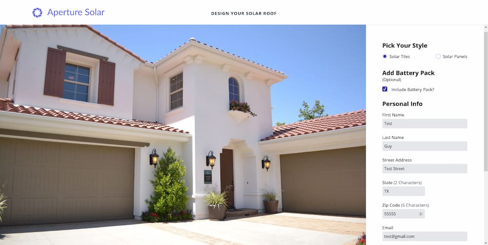

# Aperture Solar

[View Live Site](https://apcurran-aperture-solar.herokuapp.com/)

## Features:

- Choose your own Solar products to suit unique needs (solar tile or panel design, along with optional power-storing battery)

- Solar price is based upon the total square footage of the home, device type, and battery inclusion/exclusion -- it is calculated dynamically within the form

- Stripe payments (using Stripe Payment Intents API)

- Automatic email receipt for order invoice (in production Stripe version -- code is already implemented)

- Express JS back-end

- PostgreSQL DB with native PG driver

- All custom CSS layout/styling with modern CSS features (Grid, Flexbox, Custom Properties, etc.)

